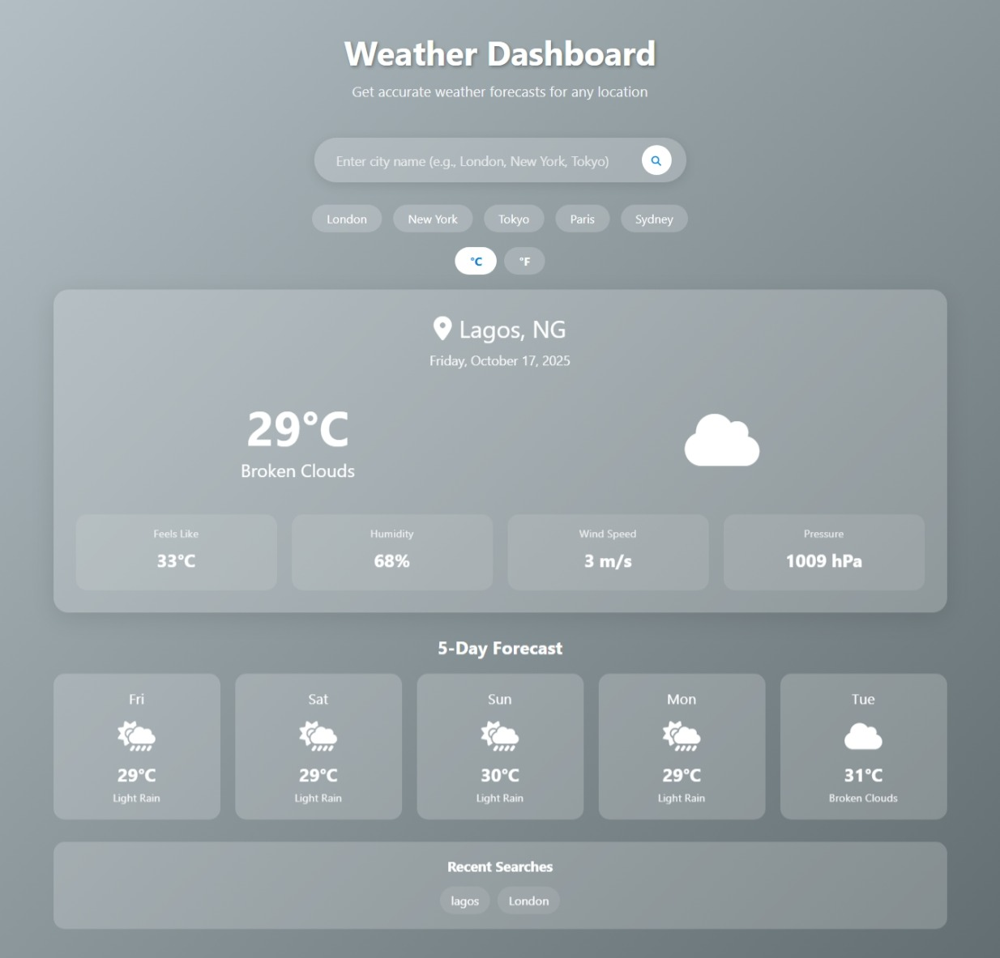

<h1 align="center">🌦️ Weather Dashboard</h1>

<p align="center">
  <a href="https://adebayo-makemoney.github.io/weather-dashboard/"><strong>🌍 Live Demo</strong></a> •
  <a href="https://github.com/Adebayo-makemoney/weather-dashboard"><strong>📂 GitHub Repo</strong></a>
</p>

---

## 🧭 About the Project

The **Weather Dashboard** is a sleek and responsive web app that displays **current weather conditions** and a **5-day forecast** for any city worldwide using the **OpenWeatherMap API**.  
It’s designed for clarity, accessibility, and real-time weather updates.

---

## 🛠️ Built With

<p align="center">
  
</p>

- **HTML5** – Semantic structure and accessibility  
- **CSS3** – Responsive design with Flexbox and Grid  
- **JavaScript (ES6+)** – Async/await, Fetch API, DOM manipulation  
- **OpenWeatherMap API** – Real-time weather data  
- **Font Awesome** – Beautiful icons for UI elements  

---

## ✨ Features

✅ Current weather: temperature, humidity, wind, and icons  
✅ 5-day forecast with clear layout  
✅ City search with real-time results  
✅ Persistent search history (Local Storage)  
✅ Dynamic background based on weather condition  
✅ Celsius/Fahrenheit toggle  
✅ Fully responsive for all devices  

---

## 🚀 Live Demo

🌐 [**Try it here**](https://adebayo-makemoney.github.io/weather-dashboard/)  
Example cities: **London**, **New York**, **Tokyo**, **Paris**, **Sydney**

---

## 🖼️ Screenshot

<p align="center">
  
</p>

---

## ⚙️ Installation

### Option 1 — Direct Download
1. Download all files (`index.html`, `styles.css`, `script.js`)
2. Open `index.html` in your browser

### Option 2 — Clone Repository
```bash
git clone https://github.com/Adebayo-makemoney/weather-dashboard.git
cd weather-dashboard
start index.html
```

---

## 📁 Folder Structure

```
weather-dashboard/
│
├── index.html          # Main HTML file
├── styles.css          # Styling and responsiveness
├── script.js           # JavaScript and API logic
└── README.md           # Documentation
```

---

## 🔑 API Configuration

This project uses the **OpenWeatherMap API**.

1. Sign up at [OpenWeatherMap](https://openweathermap.org/api)
2. Get your **API key**
3. Replace the placeholder key in `script.js`:

```javascript
const API_KEY = 'create_yours_at_www.home.openweathermap.org';
```

---

## 💡 Usage

1. Enter a city name and click **Search**  
2. Switch temperature units (**°C / °F**)  
3. View the **5-day forecast** below  
4. Click previously searched cities to reload instantly  

---

## 🔍 API Endpoints Used

- **Current Weather:** `https://api.openweathermap.org/data/2.5/weather`
- **5-Day Forecast:** `https://api.openweathermap.org/data/2.5/forecast`

---

## 🧠 Future Enhancements

- 🌍 Add geolocation for automatic weather detection  
- ⚠️ Include weather alerts and notifications  
- 🗺️ Integrate radar and map views  
- 🕓 Add local time and date display  

---

## 🧩 Troubleshooting

### 🔸 City Not Found
- Check spelling or use English city names

### 🔸 API Key Issues
- Wait 10–20 minutes after generating key  
- Ensure your email is verified on OpenWeatherMap

### 🔸 No Weather Data
- Check internet connection  
- Verify API URLs and key  
- Inspect the browser console for errors  

---

## 🤝 Contributing

1. Fork the repository  
2. Create a branch: `git checkout -b feature/AmazingFeature`  
3. Commit your changes: `git commit -m 'Add some AmazingFeature'`  
4. Push: `git push origin feature/AmazingFeature`  
5. Open a Pull Request  

---

## 🧾 License

This project is licensed under the **MIT License** — see the `LICENSE` file for details.

---

## 🙏 Acknowledgments

- [OpenWeatherMap](https://openweathermap.org/) — API Provider  
- [Font Awesome](https://fontawesome.com/) — Icons  
- Inspiration from modern, user-friendly weather dashboards  

---

## 📬 Support

Having issues?  
- Visit the [OpenWeatherMap FAQ](https://openweathermap.org/faq)  
- Open an issue on [GitHub](https://github.com/Adebayo-makemoney/weather-dashboard/issues)  

---

⭐ **If you like this project, please give it a star!**
